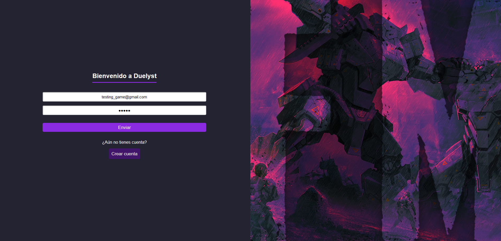
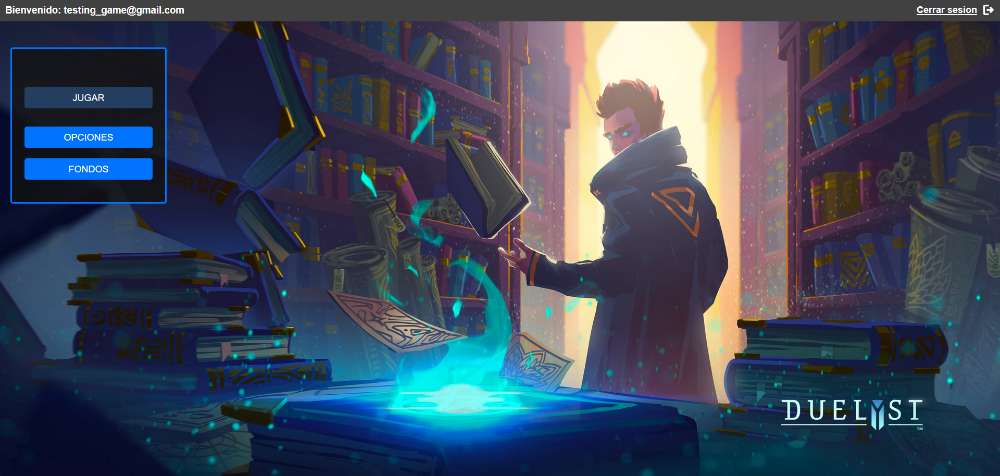
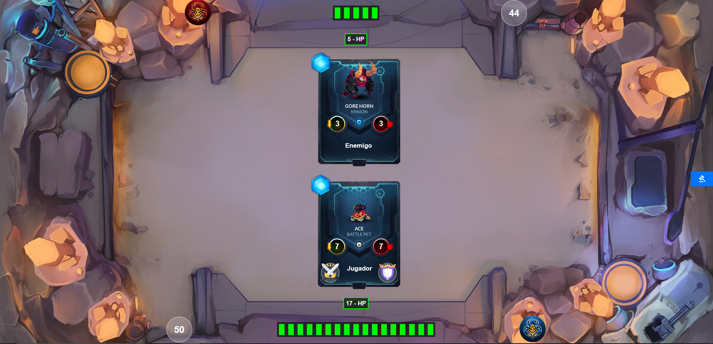

# Duelyst

This is a php project based on making a card game based on the Duelyst videogame.

---

---

## Table of contents

- [Description](#description)
- [Technologies](#technologies)
- [Issues](#issues)
- [Installation](#installation)

## Description

This is a php project based on making a card game based on the Duelyst video game.

The web has email registration to be able to log in, music playback, selection of images to fight in the game and finally the possibility of fighting against the machine locally. All these options can be manually activated or deactivated by the user.

## Technologies

The project has been created with:

- HTML
- CSS
- PHP 7.4
- JS

## Issues

The project has some issues in localhost:

- The email registration may fail, this is due to the PHPMailer library that I use in this project. This library can give errors depending on the configuration of your computer. Due to this, to register, I advise you to disable your antivirus or your firewall and try to register to be able to log in on the web.

- If you manage to register, you will see a validation in your email

- If you can not register for any other reason, I have left you a default user in the project database which is testing_game@gmail.com and its password is 12345

## Installation

To run this project, we need the following steps:

- I recommend you disable the option to delete cookies and site data when the browser is closed, so that the options you use within the web are saved and persist correctly. You will find this option in your browser settings.

- Download XAMPP at the following link: https://www.apachefriends.org/

- Open XAMPP control panel and turn on apache and mysql services.

- Go to your browser to the path of localhost/phpmyadmin and you will see the phpmyadmin database manager running.

- Once inside the phpmyadmin database manager, you have to click the import option. You must select the sql file, which is located in the recursos/conectividad/bbdd/sql folder of this project, which is the following: https://github.com/adri27info/Duelyst/blob/master/recursos/conectividad/bbdd/sql/duelyst.sql

- Once the database is imported through the sql file, we go to the htdocs folder and create the apps/php/ folder and put the Duelyst project inside the php folder, so that everything works. Once this is done we put in the browser http://localhost/apps/php/Duelyst and we will see that the application will execute correctly.

- Finally to access the page, we will have to register or use the default user that I have left in the database which is testing_game@gmail.com and its password is 12345
